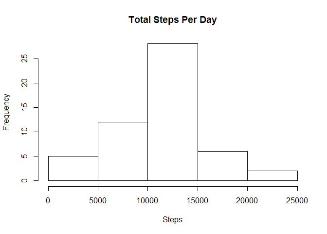
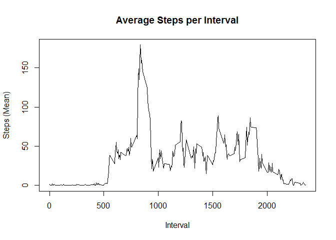
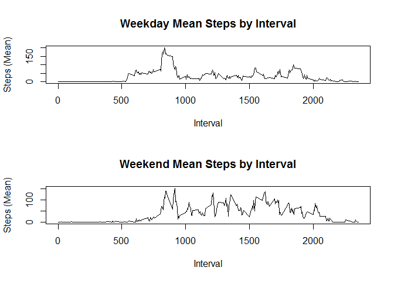

# Reproducible Research: Peer Assessment 1


## Loading and preprocessing the data


```r
activity<-read.csv("activity.csv")
activity$date<-as.Date(activity$date)
```


## What is mean total number of steps taken per day?


```r
dayagg<-aggregate(steps~date,data=activity,sum)
hist(dayagg$steps,xlab="Steps",main="Total Steps Per Day")
```

<!-- -->

```r
print(paste("Mean steps per day: ",mean(dayagg$steps)))
```

```
## [1] "Mean steps per day:  10766.1886792453"
```

```r
print(paste("Median steps per day: ",median(dayagg$steps)))
```

```
## [1] "Median steps per day:  10765"
```


## What is the average daily activity pattern?


```r
activity2<-activity
activity2[is.na(activity2)]<-0
intervalagg<-aggregate(steps~interval,data=activity2,mean)
plot(intervalagg$interval,intervalagg$steps,type="l",
     xlab="Interval",ylab="Steps (Mean)",main="Average Steps per Interval")
```

<!-- -->

```r
print(paste("Interval with highest average steps:",intervalagg[intervalagg$steps==max(intervalagg$steps),1]))
```

```
## [1] "Interval with highest average steps: 835"
```


## Inputing missing values


```r
activity2<-activity
activity2[is.na(activity2)]<-0
```


## Are there differences in activity patterns between weekdays and weekends?


```r
weekdays<-weekdays(activity2$date)
weekdayorweekend<-matrix(rep(c(NA),times=length(activity2$date)))
for (i in 1:length(activity2$date)){
  if(weekdays[i]=="Saturday"){
    weekdayorweekend[i]<-"weekend"
  }else{
    if(weekdays[i]=="Sunday"){
    weekdayorweekend[i]<-"weekend"
    }else{
    weekdayorweekend[i]<-"weekday"
    }
  }
}
activity3<-cbind(activity2,weekdayorweekend)
weekdayagg<-aggregate(steps~interval,data=activity3[activity3$weekdayorweekend=="weekday",],mean)
weekendagg<-aggregate(steps~interval,data=activity3[activity3$weekdayorweekend=="weekend",],mean)
par(mfrow=c(2,1))
plot(weekdayagg$interval,weekdayagg$steps,type="l",
     main="Weekday Mean Steps by Interval",xlab="Interval",ylab="Steps (Mean)")
plot(weekendagg$interval,weekendagg$steps,type="l",
     main="Weekend Mean Steps by Interval",xlab="Interval",ylab="Steps (Mean)")
```

<!-- -->

```r
par(mfrow=c(1,1))
```
